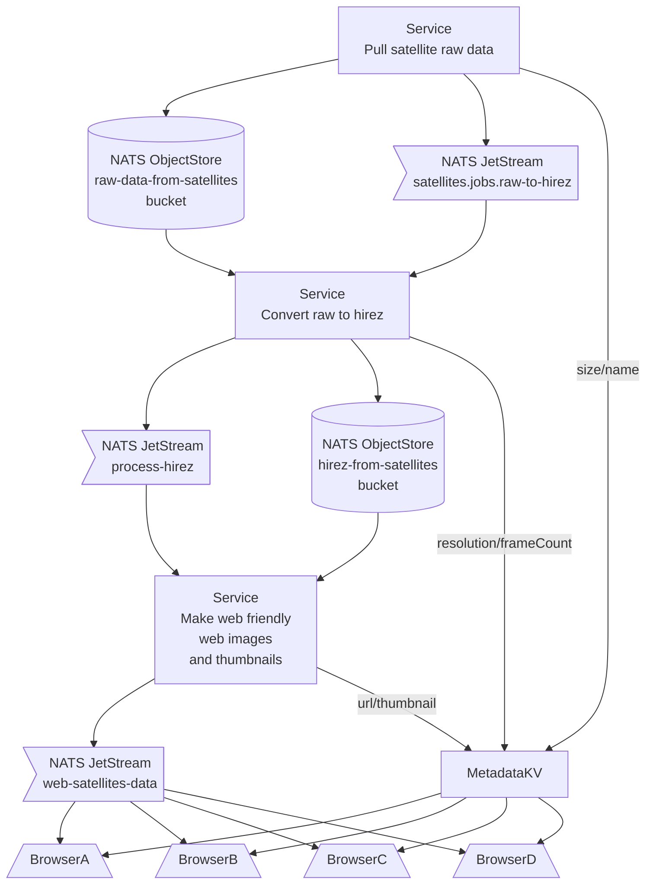

```mermaid
graph TD;
PullRawSat[Service\nPull satellite raw data]
RawObjectStore[(NATS ObjectStore\nraw-data-from-satellites\nbucket)]
ConvertHiRezJobBuffer>NATS JetStream\nsatellites.jobs.raw-to-hirez]
ConvertVideosToHiRez[Service\nConvert raw to hirez]
HiRezsFromSatellitesObjectStore[(NATS ObjectStore\nhirez-from-satellites\nbucket)]
MakeWebFriendly[Service\nMake web friendly\nweb images\nand thumbnails]
WebFriendlySatellitesObjectStore>NATS JetStream\nweb-satellites-data]
WebFriendlyJobBuffer>NATS JetStream\nprocess-hirez]

PullRawSat-->RawObjectStore
PullRawSat-->ConvertHiRezJobBuffer
PullRawSat-->|size/name|MetadataKV
ConvertHiRezJobBuffer-->ConvertVideosToHiRez
RawObjectStore-->ConvertVideosToHiRez
ConvertVideosToHiRez-->WebFriendlyJobBuffer
ConvertVideosToHiRez-->HiRezsFromSatellitesObjectStore
ConvertVideosToHiRez-->|resolution/frameCount|MetadataKV
HiRezsFromSatellitesObjectStore-->MakeWebFriendly-->WebFriendlySatellitesObjectStore
WebFriendlyJobBuffer-->MakeWebFriendly
MakeWebFriendly-->|url/thumbnail|MetadataKV

WebFriendlySatellitesObjectStore-->BrowserA[/BrowserA\]
MetadataKV-->BrowserA[/BrowserA\]
WebFriendlySatellitesObjectStore-->BrowserB[/BrowserB\]
MetadataKV-->BrowserB[/BrowserB\]
WebFriendlySatellitesObjectStore-->BrowserC[/BrowserC\]
MetadataKV-->BrowserC[/BrowserC\]
WebFriendlySatellitesObjectStore-->BrowserD[/BrowserD\]
MetadataKV-->BrowserD[/BrowserD\]

```