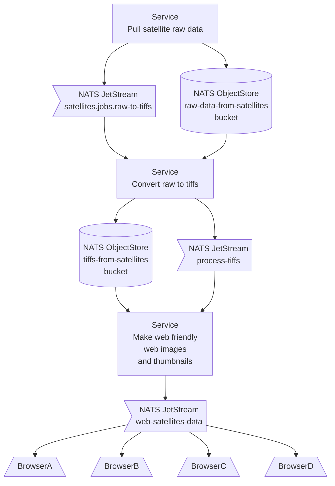

```mermaid
graph TD;
PullRawSat[Service\nPull satellite raw data]
RawObjectStore[(NATS ObjectStore\nraw-data-from-satellites\nbucket)]
ConvertTiffJobBuffer>NATS JetStream\nsatellites.jobs.raw-to-tiffs]
ConvertVideosToTiff[Service\nConvert raw to tiffs]
TiffsFromSatellitesObjectStore[(NATS ObjectStore\ntiffs-from-satellites\nbucket)]
MakeWebFriendly[Service\nMake web friendly\nweb images\nand thumbnails]
WebFriendlySatellitesObjectStore>NATS JetStream\nweb-satellites-data]
WebFriendlyJobBuffer>NATS JetStream\nprocess-tiffs]

PullRawSat-->RawObjectStore
PullRawSat-->ConvertTiffJobBuffer
ConvertTiffJobBuffer-->ConvertVideosToTiff
RawObjectStore-->ConvertVideosToTiff
ConvertVideosToTiff-->WebFriendlyJobBuffer
ConvertVideosToTiff-->TiffsFromSatellitesObjectStore
TiffsFromSatellitesObjectStore-->MakeWebFriendly-->WebFriendlySatellitesObjectStore
WebFriendlyJobBuffer-->MakeWebFriendly

WebFriendlySatellitesObjectStore-->BrowserA[/BrowserA\]
WebFriendlySatellitesObjectStore-->BrowserB[/BrowserB\]
WebFriendlySatellitesObjectStore-->BrowserC[/BrowserC\]
WebFriendlySatellitesObjectStore-->BrowserD[/BrowserD\]

```